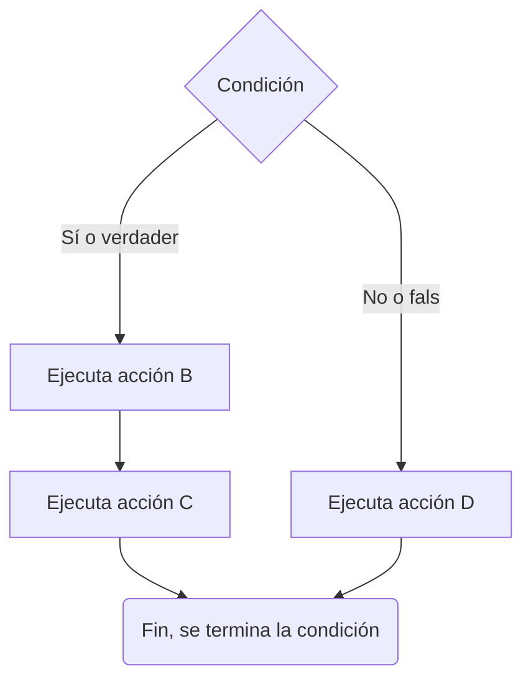
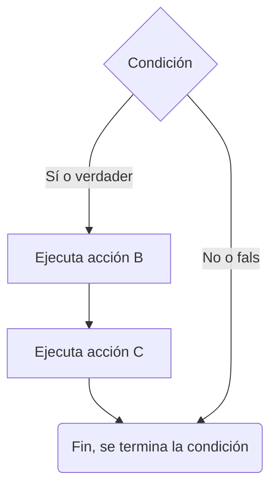
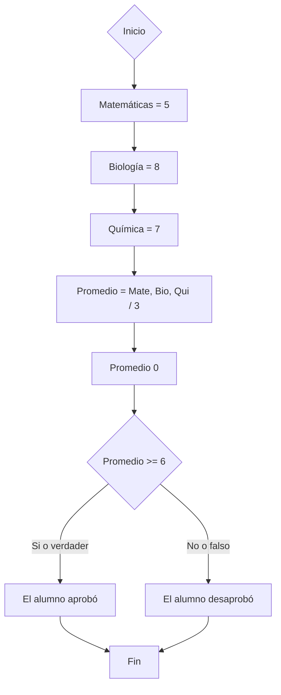
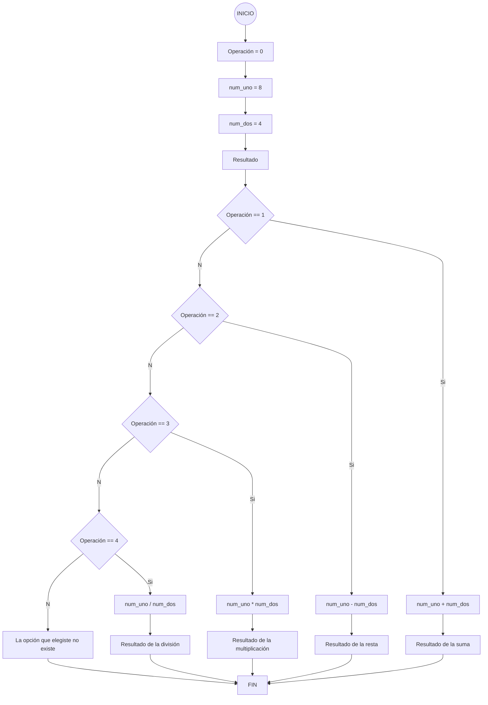

# Introducción e instalación de JDK
**JAVA**
Es un lenguaje de programación orientado a objetos multiplataforma.
Para programar en JAVA necesitamos:

   * Descargar el JDK.
   * Bloc de notas y CMD.

**Al no programar con editores profesionales o entornos de desarrollo (IDE), la retención de sintaxis es mayor y el desarrollo de la habilidad incrementa bastante al no tener ayuda.**

*Minecraft, OpenOffice y Android se desarrollaron en JAVA.*

```cmd
java -version
```
## Indentado, compilación y ejecución del código
El código se debe de leer de arriba hacia abajo y de derecha a izquierda.
La primera línea que debemos escribir es el nombre de nuestra clase. En java necesitamos de clases para poder ejecutar un programa y esa clase es la que va a contener el código que nosotros vamos a escribir. El método main es donde va a dar inicio tu programa. Lo que va a permitir que lo podamos ejecutar.

**Los archivos java se guardan con el mismo nombre de la clase.**

Con Java necesitamos un compilador `javac`, esto lo traduce.
Escribimos en el cmd:
`javac name.java`
Luego creará el archivo `name.class`.
Ahora `java name`.
Así se ejecuta un programa desde 0 en java.

## Errores sintáticos y lógicos
Estandarización: Standard de java, empieza el nombre de nuestra clase con mayúscula.

```java
public class Error{
  public static void main(String args[]){
   System.out.println("Hello world"); 
 }
}
```
Un error lógico se pueden causar por dos errores: error lógico del código o error lógico del programador.
Errores sintácticos: falta de punto y coma, que hayas puesto mal un paréntesis, mal el nombre de una variable. Un programa no se va a poder ejecutar si no corriges los errores.
*Aprender a leer errores*

## Variables y tipos de datos en JAVA
**Primitivos**
*Enteros*

  * byte (-128 hasta 127)
  * short (-32,768 hasta 32,767)
  * int (-2,147,483,648 hasta 2,147,483,647)
  * long (muy grande...)

**Decimales** (nos permiten alojar valores con punto decimal)
   
   * float
   * double

**Otros**

   * char (un solo caracter)
   * booleand (true/false)

**Tipos objeto** (son clases)

   * String, ejemplo 'Hola mundo'.

## Variables
Una variable es un espacio en memoria donde nosotros vamos a poder alojar información o datos ya sean de tipos numérico o de tipo texto.
Para que nosotros declaremos una variable, necesitamos de dos elementos. En primer lugar, necesitamos de un `tipo` de dato y el segundo necesitamos de un `nombre`. Con el tipo de dato le vamos a decir al espacio en memoria qué tipo de información o dato va a recibir. Con el nombre vamos a decirle a nuestro programa a que variable o espacio en memoria estamos haciendo referencia. 

Ejemplo:
`Tipo: int nombre: numUno`
Programamos una suma:

```java

public class Suma{
  public static void main(String args[]){
 
   int numUno = 5;
   int numDos = 2;
   int resultado = 0;
   
   resultado = numUno + numDos;
   System.out.println("El valor de tu suma es: " + resultado);
 }
}
```

## Operadores aritméticos y prioridad de los signos
| **Signo** | **Nombre del Signo** | **Tipo de operación** | **Código ASCII** |
|:-------:|:------------------:|:-------------------:|:-------------:|
| **+** | Más | Suma | **ALT + 43** |
| **-** | Menos | Resta | **ALT + 45** |
| **(*)** | Asterisco | Multiplicación | **ALT + 42** |
| **/** | Diagonal o Slash | División | **ALT + 47** |
| **^** | Acento circunflejo | Potencia | **ALT + 94** |
| **(** | Paréntesis apertura | Prioridad entre operaciones | **ALT + 40** |
| **)** | Paréntesis cierre | Prioridad entre operaciones | **ALT + 41** |

## Prioridad entre operadores
Cuando tu realizas una operación en matemáticas o en programación, existe una piramide donde se va a ejecutar de arriba hacia abajo. Cuando nosotros programemos o realizemos una operación siempre se va a resolver lo que está dentro de `()`, posteriormente va a buscar `^` y si posteriormente no encuentra, seguirá con `*, /`, por último `+ y -`. Siempre esta va a ser la prioridad.
Ejemplo:

```java

public class Operaciones{
  public static void main(String args[]){
 
   int numUno = 4;
   int numDos = 4;
   int resultado = 0;

   resultado = numUno + numDos / 2;
   System.out.println("El resultado incorrecto: " + resultado);

   resultado = (numUno + numDos) / 2;
   System.out.println("El resultado correcto: " + resultado);
 }
}
```
## Estructuras condicionales con if-else
Es una instrucción que ayuda a nuestros programas a saber qué proceso o qué camino debe de seguir dependiendo en la situación que se encuentre.
Una estructura condicional si no tiene condición no puede ser estructura condicional. No hay camino o proceso que seguir.

**Ejemplo:**
Condiciones:

**Situación: ¿Mamá, puedo ir a la fiesta?**
**Condición: Si quieres ir, debes hacer tu tarea.**


## Estructuras condicionales simples
Uno de los dos caminos va a tener instrucciones el otro no.


## Estructura condicionales compuestas
Van a tener instrucciones por ambas partes, es la del primer ejemplo.


### Ejemplo práctico

Realizar un programa que calcule el promedio final de seis materias y que el programa nos indique si el alumno aprobó o reprobó.

Las calificaciones son:

  * Matemáticas: 5
  * Biología: 8
  * Química: 4

Nuestro programa va a arrancar `inicio`, una vez que tenga un inicio vamos a utilizar espacios en memoria `calificaciones materias` que son las variables. Estas variables van a contener las calificaciones de las materias. Y esa variables se van a llamar como se llaman las materias. Posteriormente, comenzamos a hacer una análisis, una vez que calculemos el promedio necesitaremos alojar ese promedio en algún lugar. Es por eso que abrimos una nueva variable `Promedio = 0` con valor 0. El 0 es porque al ser un valor que va a utilizar nros enteros tenemos que inicializarla con un valor numerico. En este caso 0 no vale nada. Luego debemos de realizar una pequeña fórmula para calcular el promedio. `Materias  / 3`. Sumar las materias y dividirlo por 3.
Después de calcular el promedio, comeinza la estructura condicional.




```java
public class Promedio{
  public static void main(String args[]){

   int matematicas = 5;
   int biologia = 8;
   int quimica = 7;
   int promedio = 0;

   promedio = (matematicas + biologia + quimica) / 3;
   
   if(promedio >= 6){
    System.out.println("El alumno aprobó " + promedio); 
   } else {
    System.out.println("El alumno desaprobó " + promedio);
   }
 }   
}
```

## Estructuras condicionales anidadas con if-else
Una estrucutra condicional se convierte en anidada cuando está dentro de otra estructura condicional. 

Realizar un programa que pueda realizar una suma, una resta, una multiplicación o una división de dos números enteros, dependiendo de la decisión del usuario:
  
  * Si operación es igual a 1, realizar una suma
  * Si operación es igual a 2, realizar una resta
  * Si operación es igual a 3, realizar una multiplicación
  * Si operación es igual a 4, realizar una división



```java
public class Operaciones{
  public static void main(String args[]){
   
   int operacion = 1;
   int num_uno = 8;
   int num_dos = 4;
   int resultado = 0;

   if(operacion == 1){
     resultado = num_uno + num_dos; 
     System.out.println("EL resultado de la suma es: " + resultado);
   } else if(operacion == 2){
     resultado = num_uno - num_dos;
     System.out.println("El resultado de la resta es: " + resultado);
   } else if(operacion == 3){
    resultado = num_uno * num_dos;
    System.out.println("El resultado de la multiplicación es " + resultado);   
   } else if(operacion == 4){
    resultado = num_uno / num_dos;
    System.out.println("El resultado de tu división es: " + resultado);
   } else {
    System.out.println("La opción que elegiste no existe");
   }
 }
}
```