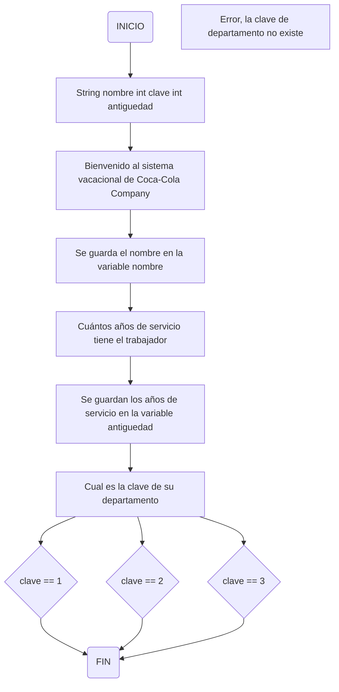

# Como introducir datos desde el teclado con scanner
Cuando comenzamos a programar en ocasiones requerimos interactuar con el usuario. Que nuestro programa le permita al usuario introducir datos desde el teclado. Vamos a diseñar un programa donde le pida tanto su nombre y números para poder sumarlos. Para esto vamos a utilizar una librería `Scanner`.
Conjunto de códigos escritos por alguien más. Para poder hacer uso de estas librerías, debemos importarlas.
Scanner es una sublibreria que nos permite poner datos. Para hacerlos más dinámico.

Importar :

```java
import java.util.Scanner;
```

```java
import java.util.Scanner;

public class Suma{
 public static void main(String args[]){

   Scanner in  = new Scanner(System.in); /*Vamos a introducir datos con ayuda de la clase System*/
   String nombre = "";
   int numUno = 0, numDos = 0, resultado = 0;

   System.out.println("¿Cuál es tu nombre?"); /*Despues de este mensaje se va a detener por un momento hasta que el usuario escriba algo y presione la tecla enter*/
   nombre = in.nextLine(); /*Si guardamos valores numericos in.nextInt*/
   /*Viene a nuestro objeto in recoge los datos y los va a guardar en la variable nombre y luego se limpia nuestro objeto*/
   System.out.println("Dame el primer valor para tu suma: ");
   numUno = in.nextInt();
   System.out.println("Dame el segundo valor para tu suma:");
   numDos = in.nextInt();

   resultado = numUno + numDos;

   System.out.println("Hola " + nombre + " el resultado de tu suma es: " + resultado);
 }   
}
```

## Condiciones compuestas con operadores lógicos y relacionales

| Operador |         Nombre         |    Ejemplo    |       Significado        |
| :------: | :--------------------: | :-----------: | :----------------------: |
|    <     |       Menor que        |     5 < 4     |     5 es menor que 4     |
|    >     |       Mayor que        |     A > B     |     A es mayor que B     |
|    ==    |       Igual que        |    5 == 5     |     5 es igual que 5     |
|    !=    | No igual a (diferente) | perro != gato | perro no es igual a gato |
|    <=    |  Menor que o igual a   |    A <= B     |  A es menor que o igual  |
|    >=    |  Mayor que o igual a   |    A >= B     |  A es mayor que o igual  |

## Operadores lógicos

| Operador | Nombre |           Ejemplo            |         Significado         |    ASCII     |
| :------: | :----: | :--------------------------: | :-------------------------: | :----------: |
|    &&    |  And   | Haz la tarea && lava la ropa | Haz la tarea y lava la ropa |   Alt + 38   |
|          |        |                              |             Or              | Haz la tarea |  | lava la ropa | Haz la tarea o lava la ropa | Alt + 124 |

> [!note]
> Práctica propuesta

La empresa **Coca-cola company** solicita que determine los días de vaciones a los que tiene derecho un trabajador, tomando en cuenta las siguientes características:

Existen tres departamentos dentro de la empresa con sus respectivas claves:

1. Departamento de Atención al cliente. (Clave 1)
2. Departamento de logística. (Clave 2)
3. Gerencia. (Clave 3)

Trabajadores con **clave 1** (Atención al cliente):

* Con 1 año de servicio, reciben 6 días de vacaciones.
* Con 2 a 6 años de servicio, reciben 14 días de vacaciones.
* A partir de 7 años de servicio, reciben 20 días de vaciones.

Trabajadores con **clave 2** (Logística):

* Con 1 año de servicio, reciben 7 días de vacaciones.
* Con 2 a 6 años de servicio, reciben 15 días de vacaciones.
* A partir de 7 años de servicio, reciben 22 días de vacaciones.

Trabajadores con **clave 3** (Gerencia):

* Con 1 año de servicio, reciben 10 días de vacaciones.
* Con 2 a 6 años de servicio, reciben 20 días de vacaciones.
* A partir de 7 años de servicio, reciben 30 días de vacaciones.

> [!note]
> El sistema debe de solicitar el "Nombre", "Clave del departamento" y "Antiguedad" del trabajador, posteriormente mostrar un mensaje que contenga el nombre del trabajador y los dias de vacaciones a los que tiene derecho.

**Trabajadores**

* Gerardo clave 3, tiene 3 años de servicio. Merece 20 días de vacaciones.
* Lui clave 1, tiene 1 año de servicio. Merece 6 días de vacaciones.
* Félix clave 2, tiene 12 años de servicio. Merece 22 días de vacaciones.



## Sistema de control vacacional

```java
import java.util.Scanner;

public class Sistema{
  public static void main(String args[]){
    Scanner  entrada = new Scanner(System.in);
    String nombre = "";
    int clave = 0, antiguedad = 0;
    
    System.out.println("*******************************************************");
    System.out.println("*Bienvenido al sistema vacacional de Coca Cola Company*");
    System.out.println("*******************************************************");
    System.out.println("");
    System.out.println("");

    System.out.print("Cual es el nombre del trabajador?: ");
    nombre = entrada.nextLine();
    System.out.println("");

    System.out.print("Cuanto tiempo de servicio tiene el trabajador?: ");
    antiguedad = entrada.nextInt();
    System.out.println("");

    System.out.print("Cual es la clave del trabajador?: ");
    clave = entrada.nextInt();
    System.out.println("");

    if(clave == 1){ 

      if(antiguedad == 1){
        System.out.println("El trabajador " + nombre + " tiene derecho a 6 dias de vaciones")   
      } else if(antiguedad >= 2 && antiguedad <= 6) {
        System.out.print.ln("El trabajor " + nombre + " tiene derecho a 14 dias de vacaciones");
      } else if(antiguedad >= 7){
        System.out.print.ln("El trabajador " + nombre + " tiene derecho a 20 dias de vacaciones");
      }
    } else if(clave == 2){
      if(antiguedad == 1){
        System.out.println("El trabajador " + nombre + " tiene derecho a 7 dias de vaciones")   
      } else if(antiguedad >= 2 && antiguedad <= 6) {
        System.out.print.ln("El trabajor " + nombre + " tiene derecho a 15 dias de vacaciones");
      } else if(antiguedad >= 7){
        System.out.print.ln("El trabajador " + nombre + " tiene derecho a 22 dias de vacaciones");
      }

    } else if(clave == 3){
      if(antiguedad == 1){
        System.out.println("El trabajador " + nombre + " tiene derecho a 10 dias de vaciones")   
      } else if(antiguedad >= 2 && antiguedad <= 6) {
        System.out.print.ln("El trabajor " + nombre + " tiene derecho a 20 dias de vacaciones");
      } else if(antiguedad >= 7){
        System.out.print.ln("El trabajador " + nombre + " tiene derecho a 30 dias de vacaciones");
      }

    } else {
      System.out.print.ln("Error!, la clave de departamento es incorrecta")
    }
 }
}
```

## Sistemas de control switch & case
Un switch-case es una estructura de control que se utiliza para agilizar la toma de decisiones múltiples. Su funcionamiento es muy similar a la de un menú de opciones.
Con if tengo una estructura condicional, con switch una estructura de control.
Las opciones dentro se les conoce como `case`. Cuando terminas de escribir las instrucciones correspondientes a case, siempre va un `break`. Se terminó de ejecutar el caso.
Parámetros: una variable utilizada para recibir valores de entrada.
Switch en esos parámetros solo permite dos tipos de datos, int y char (entero y caracteres).

```java
public class Operaciones{
  public static void main(String args[]){ 
  int num_uno = 5; num_dos = 3, resultado = 0;
  int param = 2;

  switch(param){

    case 1: resultado = num_uno + num_dos;
            System.out.println("El resultado de la suma es: " + resultado);
            break;

    case 2: resultado = num_uno - num_dos;
            System.out.println("El resultado de la resta es: " + resultado);
            break;

    case 3: resultado = num_uno * num_dos;
            System.out.println("El resultado de la multiplicación es: " + resultado);
            break;

    case 4: resultado = num_uno / num_dos;
            System.out.println("El resultado de la división es: " + resultado);
            break;
    
    default: System.out.println("Error, la opción no existe")
  }
 }
}
```

## Ciclos o Bucles (Estructura repetitiva for)
Es una estructura repetitiva hasta que la condición propuesta se cumpla.

Condición: "Dar cinco vueltas"
Intrucción: "Dar un salto"
Contador: 0

Ejemplo: 5 personas están tomadas de las manos girando. Para establecer un ciclo, debemos establecer una condición que es `Dar cinco vueltas`. Estas personas se toman de las manos y dan cinco vueltas. Posteriormente vamos a darle una `Instrucción` que es `Dar un salto`. Cada vez que termine un giro, deben dar un salto. Así hasta cumplir la condición de la cantidad de vueltas. Contador es donde van a dar los saltos.

En programación, es posible recrear estos ciclos. Para ello tenemos a la estructura repetitiva `for`.

## Estructura repetitiva for
El for dentro de los parentesis tiene 3 secciones: inicio, la condicion y el incremento. El inicio consiste en poder establecer una variable con un valor de arranque, en este caso estamos diciendo que nuestra variable se llama `i`. Por lo general la variable que se utiliza dentro del `for` es la `i`, porque hace referencia a un indice. Otra cosa que te permite el `for` es que te permite declarar una variable dentro de si mismo. En el ejemplo estamos declarando una variable del tiempo entero y le estamos asignando un valor de arranque de 1. No es obligatorio que se declare la variable dentro, pero si es recomendable. A no ser que necesites declarar la variable por fuera del for. Solo en la primera vuelta del arranque se va a ejecutar esta parte, despues ya no la vuelve a tocar el for. Posteriormente tenemos la condición, es quien establece en que momento se debe detener el `for`. En este momento la condicion estamos indicando que mientras el valor de `i` sea menor o igual a 5, que se siga ejecutando y en el momento que la condición deje de cumplirse. En ese momento ya no va a entrar el for. Y finalmente, tenemos lo que es el incremento, es quizás la parte más importante del for. Porque sin ningún incremento el for jamás va a incrementar y por ende jamás va a cambiar el valor de la variable que estamos utilizando en el arranque. Estos incrementos son muy importantes. En primer lugar, tenemos la forma ++, esto quiere decir que le está indicando a la variable que va a ir incrementando de 1 en 1. Si pones una variable y seguido de esa variable pones ++i. Tu le estás diciendo a la variable que debe incrementar de uno en uno cada vez que pase por esta parte. Ahora si tuvieramos --, le indica que debe restar de uno en uno. Es decir, un `decremento`.
Ahora que pasa si yo quiero incrementar o decrementar mi variable de 2 en 2 o de 3 en 3. Para eso existe algo que son las variables de **acumulación**. Esas variables te permiten ir acumulando un valor determinado. Por ejemplo, si yo quiero ir incrementando de 2 en 2, debería poner un `i+=` acá estoy indicandole a mi variable que quiero incrementar mis datos, únicamente basta que yo le ponga `i+=2` si yo le pongo un 2, va a incrementar de 2 en 2. Lo mismo con otros valores. Lo mismo para decrementar `i-=2`.


```java
for(inicio; codicion; incremento){
  Instruccion...
}
```
Ejemplo: Realizar un programa que imprima la siguiente serie numérica:

1, 2, 3, 4, 5,

```java
for(int i = 1; i <= 5; i ++){
  System.out.print(i + ", ");
}
```
Impresión en pantalla: 1, 2, 3, 4, 5,

>[!Important]
> System.out.print(ln) Es para saltos de linea

## Ciclos o Bucles (Estructura repetitiva while)
En java para poder crear ciclos o bucles también podemos utilizar la estructura repetitiva while, que en español significa "mientras". Para ello, primero debemos entender cuál es su funcionamiento y cómo se comporta esta herramienta repetitiva.

Ejemplo: Realizar un programa que imprima en pantalla la siguiente serie numérica: 1, 3, 5, 7, 9,

```java
int i = 1;

while(i < 10){
  System.out.print(i + ", "); /*Imprime todo de forma horizontal*/
  i+=2;
}
```
Lo primero que tenemos que saber es que siempre que utilizemos la estructura repetitiva `while` siempre la debemos de escribir en minúscula. Posteriormente, entre paréntesis debemos colocar una condición. A diferencia del `for` únicamente puedes poner entre paréntesis una condición, no vale que declares una variable adentro, ni mucho menos que hagamos el incremento adentro. Unicamente debemos de poner una condición. Posteriormente, las llaves de apertura y cierre, que es lo que va a indicar qué debe hacer el while en caso de que sus condición se cumpla. En el ejemplo, le estamos diciendo que mientras `i` sea menos que 10 se cumpla o se ejecute lo que esta dentro de llaves. De lo contrario que no entre y que brinque a la siguiente etapa del programa. Luego de las llaves debemos colocar las intrucciones `System.out.print(i + ", ");` según el ejemplo. En esta ocasión solo estamos mandando a imprimir el valor de i y concatenamos una coma y un espacio. Y finalmente, siempre debemos de colocar el incremento dentro del `while` ahora este incremento no importa si lo pones al principio o al final, pero sí se debe tener cuidado, depende de donde se ponga,  el comportamiento o el resultado que te arroje el programa. Por ejemplo, no es lo mismo que me va imprimir si ponemos `i+=2;` este incremento abajo que arriba, nos mandaría un resultado totalmente diferente.

En el for podíamos declarar la variable dentro, pero en while no nos permite eso, por eso siempre hay que declararla antes de indicar que vamos a utilizar un while. En esta ocasión estamos indicando que queremos una variable del tipo entero que se llama i y que va a iniciar con un valor de 1. Este valor es porque la consigna nos indica que el primer valor que se debe de imprimir en pantalla es el 1. Una vez que el programa ya inició, ahora si entra en la parte de while.

## Ciclos o Bucles (Estructura repetitiva do-while)
Para poder realizar ciclos o bucles tenemos una última estructura repetitiva que es do-while. Que por su traducción al español es hacer y mientras. 
Esta estructura se divide en dos secciones: la parte en donde le vamos a decir qué instrucciones debe de realizar y la parte de las condiciones que es donde nosotros vamos a poder controlar en qué momento se debe de detener este ciclo.

```java
do{
  intrucciones...
} while(condición);
```
Nosotros cuando usamos do-while primero vamos a escribir la palabra do en minúsculas, aplicación de llaves apertura y cierre. Dentro la instrucción que queremos que se ejecute. Posteriormente, fuera de las llaves debemos colocar while y después entre paréntesis la condición que se debe cumplir para que el ciclo se sigue ejecutando.

Ejemplo:

Realizar un programa que imprima en pantalla la siguiente serie numérica: 1000, 800, 600, 400, 200, 0, /*Va en decremento*/

```java
int i = 1000;
do{
  System.out.print(i + ", ");
  i-=200;
} while(i>=0);
```
## Ejercicios para el desarrollo de la lógica
Realizar las siguientes series numéricas utilizando las estructuras repetitivas: for, while y do-while.

* 1, 2, 3, 4, 5, 6, 7, 8, 9, 10
* 1, 99, 2, 98, 3, 97, 4, 96, 5, 95
* 0, 1, 1, 2, 3, 5, 8, 13, 21, 34

```java
public class CiclosDos{
  public static void main(String args[]){

  int i = 1, j = 99;
  
  System.out.println("Serie con for: ");
  for(i = 1; 1 <= 5; i++){
   if(i < 5){
    System.out.print(i + ",");
    System.out.print(j + ",");
   } else {
    System.out.print(i + ",");
    System.out.print(j);
   }
   j--;
  }
  System.out.println("");
  
  i = 1;
  j = 99;
  
  System.out.println("Serie con while: ");
  while(i <= 5){
  if(i < 5){
    System.out.print(i + ",");
    System.out.print(j + ",");
   } else {
    System.out.print(i + ",");
    System.out.print(j);
   }
   i++;
   j--;
  }
  System.out.println("");
  
  i = 1;
  j = 99;

  System.out.println("Serie con do-while: ");
  do{
  if(i < 5){
    System.out.print(i + ",");
    System.out.print(j + ",");
   } else {
    System.out.print(i + ",");
    System.out.print(j);
   }
   i++;
   j--;
  }while(i <= 5);
 }
}
```
## Sucesión de Fibonacci


