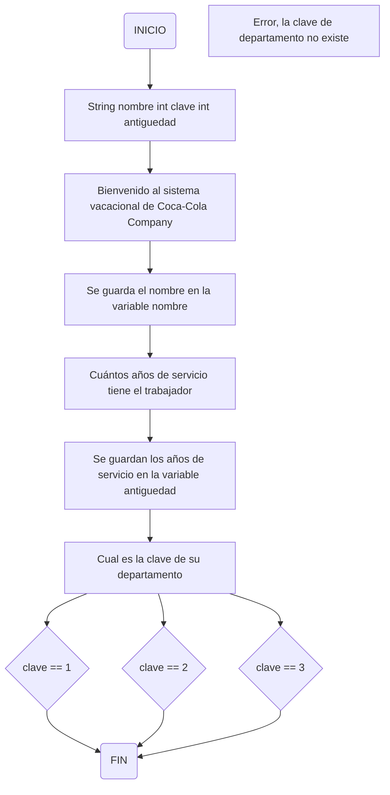

# Como introducir datos desde el teclado con scanner
Cuando comenzamos a programar en ocasiones requerimos interactuar con el usuario. Que nuestro programa le permita al usuario introducir datos desde el teclado. Vamos a diseñar un programa donde le pida tanto su nombre y números para poder sumarlos. Para esto vamos a utilizar una librería `Scanner`.
Conjunto de códigos escritos por alguien más. Para poder hacer uso de estas librerías, debemos importarlas.
Scanner es una sublibreria que nos permite poner datos. Para hacerlos más dinámico.

Importar :

```java
import java.util.Scanner;
```

```java
import java.util.Scanner;

public class Suma{
 public static void main(String args[]){

   Scanner in  = new Scanner(System.in); /*Vamos a introducir datos con ayuda de la clase System*/
   String nombre = "";
   int numUno = 0, numDos = 0, resultado = 0;

   System.out.println("¿Cuál es tu nombre?"); /*Despues de este mensaje se va a detener por un momento hasta que el usuario escriba algo y presione la tecla enter*/
   nombre = in.nextLine(); /*Si guardamos valores numericos in.nextInt*/
   /*Viene a nuestro objeto in recoge los datos y los va a guardar en la variable nombre y luego se limpia nuestro objeto*/
   System.out.println("Dame el primer valor para tu suma: ");
   numUno = in.nextInt();
   System.out.println("Dame el segundo valor para tu suma:");
   numDos = in.nextInt();

   resultado = numUno + numDos;

   System.out.println("Hola " + nombre + " el resultado de tu suma es: " + resultado);
 }   
}
```

## Condiciones compuestas con operadores lógicos y relacionales

| Operador | Nombre | Ejemplo | Significado |
|:--------:|:------:|:-------:|:-----------:|
| < | Menor que | 5 < 4 | 5 es menor que 4 |
| > | Mayor que | A > B | A es mayor que B |
| == | Igual que | 5 == 5 | 5 es igual que 5 |
| != | No igual a (diferente) | perro != gato | perro no es igual a gato |
|<= | Menor que o igual a | A <= B | A es menor que o igual |
|>= | Mayor que o igual a | A >= B | A es mayor que o igual |

## Operadores lógicos

| Operador | Nombre | Ejemplo | Significado | ASCII |
|:--------:|:------:|:-------:|:-----------:|:-----:|
| && | And | Haz la tarea && lava la ropa | Haz la tarea y lava la ropa | Alt + 38 |
| || | Or | Haz la tarea || lava la ropa | Haz la tarea o lava la ropa | Alt + 124 |

> [!note]
> Práctica propuesta

La empresa **Coca-cola company** solicita que determine los días de vaciones a los que tiene derecho un trabajador, tomando en cuenta las siguientes características:

Existen tres departamentos dentro de la empresa con sus respectivas claves:

1. Departamento de Atención al cliente. (Clave 1)
2. Departamento de logística. (Clave 2)
3. Gerencia. (Clave 3)

Trabajadores con **clave 1** (Atención al cliente):

* Con 1 año de servicio, reciben 6 días de vacaciones.
* Con 2 a 6 años de servicio, reciben 14 días de vacaciones.
* A partir de 7 años de servicio, reciben 20 días de vaciones.

Trabajadores con **clave 2** (Logística):

* Con 1 año de servicio, reciben 7 días de vacaciones.
* Con 2 a 6 años de servicio, reciben 15 días de vacaciones.
* A partir de 7 años de servicio, reciben 22 días de vacaciones.

Trabajadores con **clave 3** (Gerencia):

* Con 1 año de servicio, reciben 10 días de vacaciones.
* Con 2 a 6 años de servicio, reciben 20 días de vacaciones.
* A partir de 7 años de servicio, reciben 30 días de vacaciones.

> [!note]
> El sistema debe de solicitar el "Nombre", "Clave del departamento" y "Antiguedad" del trabajador, posteriormente mostrar un mensaje que contenga el nombre del trabajador y los dias de vacaciones a los que tiene derecho.

**Trabajadores**

* Gerardo clave 3, tiene 3 años de servicio. Merece 20 días de vacaciones.
* Lui clave 1, tiene 1 año de servicio. Merece 6 días de vacaciones.
* Félix clave 2, tiene 12 años de servicio. Merece 22 días de vacaciones.



## Sistema de control vacacional

```java
```